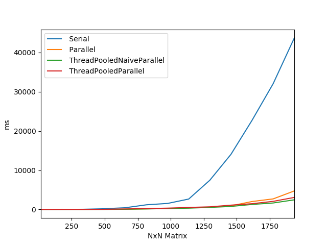

# Single Node Threaded Matrix Multiplication
Assume matrix A and B are n by b and the resultant matrix C is N by N.

### Serial Matrix Multiplication
This method is the basic method of computing a matrix, involving going through each corresponding row of A and column of B and serially summing all the multiplications. 

### Naive Parallel Matrix Multiplication
This method involves the "divide and conquer" technique that partitions matrix A and B into equal subpartitions. Each submatrix is broke down until the base case of simple elementwise multiplication is reached. Each of the results are stored in a submatrix of C. For example: C_11=A_11xB_11 + A_12xB_21, C_12 A_11xB_12 + A_12xB_22, ..., C_22=A_21xB_12 + A_22xB_22. Once all of the subcomputations of a partion of C are completed, the element in that corresponded is calculated by summing all of the previous multiplications. 

### Parallel Matrix Multiplication
This method is similar to the naive approach with one addition. Instead of all of the results being stored into a subpartion of C, another temporary matrix T is made to store the results independently. Now each subcomputation (ex: C_11=A_11xB_11 + A_12xB_21) is stored in two seperate matrices since the value of both terms is needed for the final result. Now A_11xB_11 is stored in C and A_12xB_21 is stored in T. When the necessary results are stored, the entry in the next resultant matrix can be calculated. This is done iteratively until the final resultant matrix C is computed. 

## Thread Pool
We were able to observe a self deadlock from thread pool versions especially in the thread pool parallel matrix multiplication where it submits 8 tasks for each split. If we configure a matrix to split 3 times, it creates 8*8*8=512 tasks with a threadpool of size 12 threads (I7-8750H). Due to the dependencies from each split, it creates a self deadlock. Therefore, we decided instead use newWorkStealingPool to avoid a deadlock situation.

### Thread Pool (Naive) Parallel Matrix Multiplication
This method is the same as the (naive) parallel matrix multiplication method with the addition of more thread management. In previous methods, the number of threads needed for the entire process were all created at the same time. This leads to many context switches between the threads since there is no scheduling done. With a thread pool, a specific number of threads are created and dispatched by the operating system to ensure that the resources needed are availible for each thread and that the processors can handle the number of threads executed concurrently.

## Atomic Version
We attempted to create an atomic version of the algorithms believing that non-blocking atomic type will improve the performance. However, the performance was slower due to large overhead from atomic methods. Similarly, an error in an atomic operation will result in a wrong matrix multiplication result. We decided to abandon this approach.